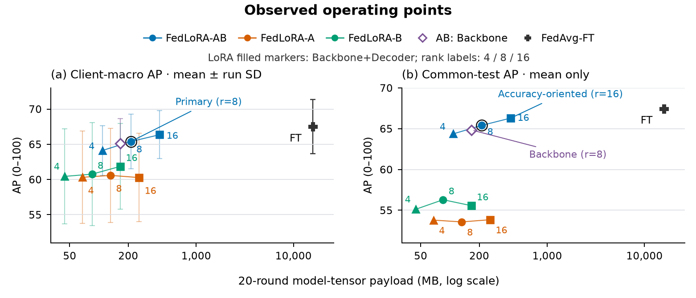
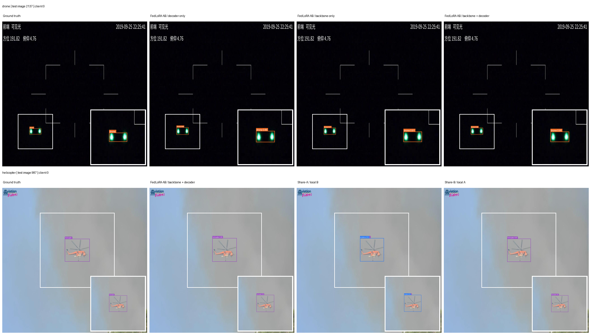

# Where to Adapt and What to Share: Federated LoRA for Aerial Object Detection

Research code and reproducibility materials for an RT-DETR-L study of **where to place LoRA adapters** and **which adapter factors to share** in three-client federated aerial-object detection. The predefined reference configuration is **FedLoRA-AB, Backbone+Decoder, rank 8**.

> **Release-candidate status.** This tree is being prepared for public release. The 96 validation-selected checkpoint binaries and the pretrained RT-DETR-L weight are **not present in this source tree**. The [checkpoint index](artifacts/checkpoint_index.json) contains recorded hashes and sizes, not downloadable models. A public artifact release, its license, and the paper citation will be linked only after verification. See the [release checklist](docs/RELEASE_CHECKLIST.md).

## At a glance

- **Task:** four-class detection (airplane, bird, drone, helicopter) on the official AOD-4 v6 COCO train/validation/test export.
- **Model:** RT-DETR-L with adapters in eligible CNN backbone convolutions and decoder self-attention Q/K/V plus cross-attention value projections.
- **Federated policies:** full fine-tuning; shared LoRA A+B+task head (**FedLoRA-AB**); shared A+head with local B (**FedLoRA-A**); shared B+head with local A (**FedLoRA-B**).
- **Primary protocol:** three clients, Dirichlet α=0.4, seeds 42/43/44, 20 rounds × five local epochs, full participation, validation-selected checkpoint.
- **Main observation:** FedLoRA-AB retains 65.39 client-macro AP versus 67.51 for federated full fine-tuning while reducing accounted 20-round model-tensor payload by 98.65%. This is an **analytical tensor-byte comparison**, not measured network traffic.



## Main results

All AP values below are on a **0–100** scale. Entries are mean ± sample standard deviation over three paired `(training seed, partition seed)` runs. “Client-macro AP” averages each aligned model's AP on its own client's test partition; “common-test AP” evaluates each aligned model on the same complete official test split and averages the resulting AP values. The common-test score is not an ensemble.

| Federated method | Client-macro AP ↑ | Common-test AP ↑ | Worst-client AP ↑ | 20-round payload ↓ |
| --- | ---: | ---: | ---: | ---: |
| FedAvg full fine-tuning | 67.51 ± 3.82 | 67.46 ± 0.41 | 60.61 ± 10.15 | 15,783.24 MB |
| **FedLoRA-AB** | **65.39 ± 3.90** | **65.41 ± 0.68** | **58.71 ± 10.50** | **212.78 MB** |
| FedLoRA-A (share A, local B) | 60.58 ± 6.67 | 53.57 ± 5.49 | 53.74 ± 11.46 | 131.68 MB |
| FedLoRA-B (share B, local A) | 60.76 ± 7.29 | 56.29 ± 4.00 | 54.51 ± 10.76 | 85.05 MB |

The 98.65% saving compares the same three-client, 20-round bidirectional shared-state accounting boundary. It excludes the initial common state, the final selected-checkpoint redistribution, serialization and network overhead. Full-FT bytes include FP32 model state and INT64 counters. See [Results and metric definitions](docs/RESULTS.md).

### What the ablations show

At rank 8 under full A+B sharing, moving from **decoder-only → backbone-only → both** yields client-macro AP **55.41 → 65.11 → 65.39**. Backbone-only needs 165.59 MB, 22.18% less than both-targets, with a 0.28-point client-macro AP gap. These target sets have unequal trainable capacity; this is a practical configuration comparison, not a parameter-matched causal test.

Across IID and severe Dirichlet α=0.1 partitions, seed-aligned common-test AP falls by **2.13 ± 1.82** points for FedLoRA-AB, versus **14.48 ± 1.24** for FedLoRA-A and **11.25 ± 1.08** for FedLoRA-B. Full fine-tuning falls by **1.43 ± 0.45** points. Thus AB is the best-retaining **evaluated rank-8 LoRA sharing policy**, not the best method overall. Client assignments differ between partition regimes, so the changes are distribution-shift sensitivity estimates rather than identical-image causal effects.

### Held-out test examples

The two rows below show **different** official AOD-4 v6 test images. Within each row, every method sees the **same** image: the top row compares LoRA placement on a drone image, and the bottom row compares factor sharing on a helicopter image. The two source groups do not occur in the training or validation split under the audited filename/SHA-256 identity rule. Images were chosen from ground truth alone, before any predictions were viewed; all models use the seed-42, validation-best checkpoint, rank 8, and a fixed **0.25 display threshold**. The white square marks a ground-truth-defined zoom region. This figure illustrates individual outputs, **not** the three-seed AP ranking.



All three placement variants detect the illustrated drone; their visible differences are mostly localization and confidence. On the illustrated helicopter, FedLoRA-A emits overlapping *helicopter* (0.624) and erroneous *airplane* (0.616) predictions at the same box; the rendered labels overlap. This one case does not establish a general class-confusion rate or superiority of a sharing policy. See the [selection protocol and interpretation limits](docs/QUALITATIVE_TEST.md). The original selection/prediction JSONs are retained in the author evidence archive, but are not part of this public draft because they contain server-specific paths and provenance details. Source images: [AOD-4, Soni et al., Mendeley Data V1](https://doi.org/10.17632/cd5z895tr2.1), licensed [CC BY 4.0](https://data.mendeley.com/datasets/cd5z895tr2/1); model boxes, insets, and annotations were added for this study.

## Reproduce the study

See [Reproducibility](docs/REPRODUCIBILITY.md) for environment setup, AOD-4 preparation, split verification, preflight checks, and commands for the primary, placement, rank, and heterogeneity experiments. The code's named entry points are:

```text
scripts/prepare_split.py            official-v6, source-group-aware client manifests
scripts/preflight.py                dataset/model/gradient validation
scripts/run_solo.sh                 three independent local baselines
scripts/run_centralized.sh          pooled-data reference models
scripts/run_fl.sh                   FedAvg-FT and three LoRA sharing policies
scripts/run_lora_grid.sh            full three-policy placement/rank grid
scripts/run_target_ablation.sh      historical FedLoRA-A target wrapper
scripts/run_rank_sensitivity.sh     historical FedLoRA-A rank wrapper
scripts/run_heterogeneity_cell.sh   IID and Dirichlet α=0.1 cells
scripts/mia_*audit.py               read-only endpoint-MIA sensitivity analyses
scripts/verify_checkpoint_assets.py read-only 96-checkpoint SHA-256 check
scripts/render_test_qualitative.py two-stage held-out test figure (select, then render)
```

The reported runs used Python 3.9.18, PyTorch 2.5.1+cu124, torchvision 0.20.1, and Ultralytics 8.4.126 on RTX A6000 GPUs. A fresh installation in a different environment should run the tests and preflight before any long training. The study used 640-pixel inputs, batch size eight, AdamW, five-effective-epoch warmup followed by cosine decay, no AMP, and no early stopping. **Do not use test AP to select a checkpoint.**

## Data and artifacts

- Download the public [AOD-4 dataset (Mendeley Data, Version 1)](https://doi.org/10.17632/cd5z895tr2.1) and use the historical AOD-4 v6 COCO export membership: 15,761 train, 4,514 validation, and 2,241 test images. The raw images are **not redistributed here**. See [Dataset and splits](docs/DATASET.md).
- A compact summary and SHA-256 inventory of nine historical schema-v7 split manifests are preserved under [`provenance/splits/`](provenance/splits/) for audit. The complete manifests are a pending separate artifact; they contain original-server paths and must **not** be edited in place. Regenerate local splits for a different data root.
- The [selected-checkpoint index](artifacts/checkpoint_index.json) covers 96 validation-selected models (4,554,894,872 bytes in total). A user-reported read-only server check verified all 96 against their recorded sizes and SHA-256 values; **public downloads are still pending**. See [Checkpoints](docs/CHECKPOINTS.md).
- The 96 complete result JSONs, their derived tables, and the frozen MIA audit are separate research artifacts. The received JSON archive's [SHA-256](artifacts/result_bundle_sha256.txt) is recorded, but its publication location and immutable release identifier will be added only after upload and verification.
- The [server-source comparison](provenance/SERVER_SOURCE_COMPARISON.md) distinguishes byte-identical experiment code from five documented release-only portability/comment edits; recovery/evidence utilities are a separate pending review.
- The [held-out test qualitative protocol](docs/QUALITATIVE_TEST.md) preselects source-disjoint test examples from ground truth before rendering with validation-selected checkpoints. The [figure](assets/qualitative_comparison_seed42.png) is included; the raw selection/prediction metadata is retained privately pending disclosure review. This is an illustration, not an additional AP result.

## Interpretation boundaries

The official export has 281 key/hash-connected source components spanning at least two train/validation/test splits, including two exact-SHA cross-split collision signals. Those numbers are **not counts of duplicated images**. Official-split AP is not demonstrated to be source- or semantic-sequence-disjoint; source-filtered detection AP was not computed. The endpoint membership-inference experiments are attack-specific observations, **not differential privacy, server-update protection, or a confidentiality guarantee**. See [Security audit scope](docs/SECURITY_AUDIT.md).

## Repository layout

| Path | Contents |
| --- | --- |
| `main.py`, `federated_main.py` | Experiment entry points |
| `models/`, `trainers/`, `data/`, `configs/`, `utils/` | Detector adapters, training, data validation and metrics |
| `scripts/` | Split generation, run launchers, aggregation, audits |
| `tests/` | Unit/regression tests |
| `provenance/splits/` | Compact historical split summary and full-manifest SHA-256 inventory |
| `artifacts/checkpoint_index.json` | Expected checkpoint SHA-256, size and experiment ID; no binaries |
| `docs/` | Reproduction, data, results, checkpoint and audit documentation |

## Citation and license

The manuscript is under preparation for submission. Author-approved citation metadata and a persistent identifier will be added when available; please cite the repository URL and exact commit in the meantime. **No project reuse license has been selected yet.** The code depends on Ultralytics; the authors must confirm the applicable software and pretrained-derived weight redistribution terms before publishing the complete code and checkpoints. Do not treat this source tree or its checksum manifest as a grant of rights to redistribute AOD-4 images or pretrained weights.
