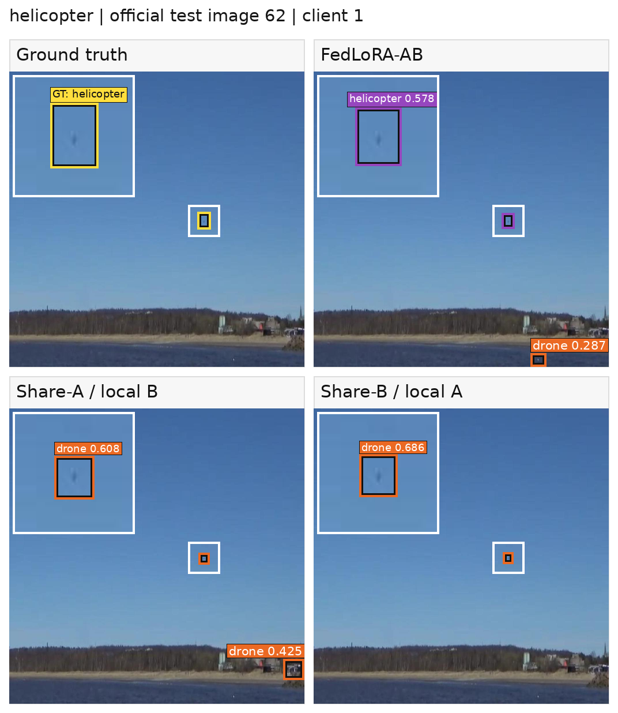
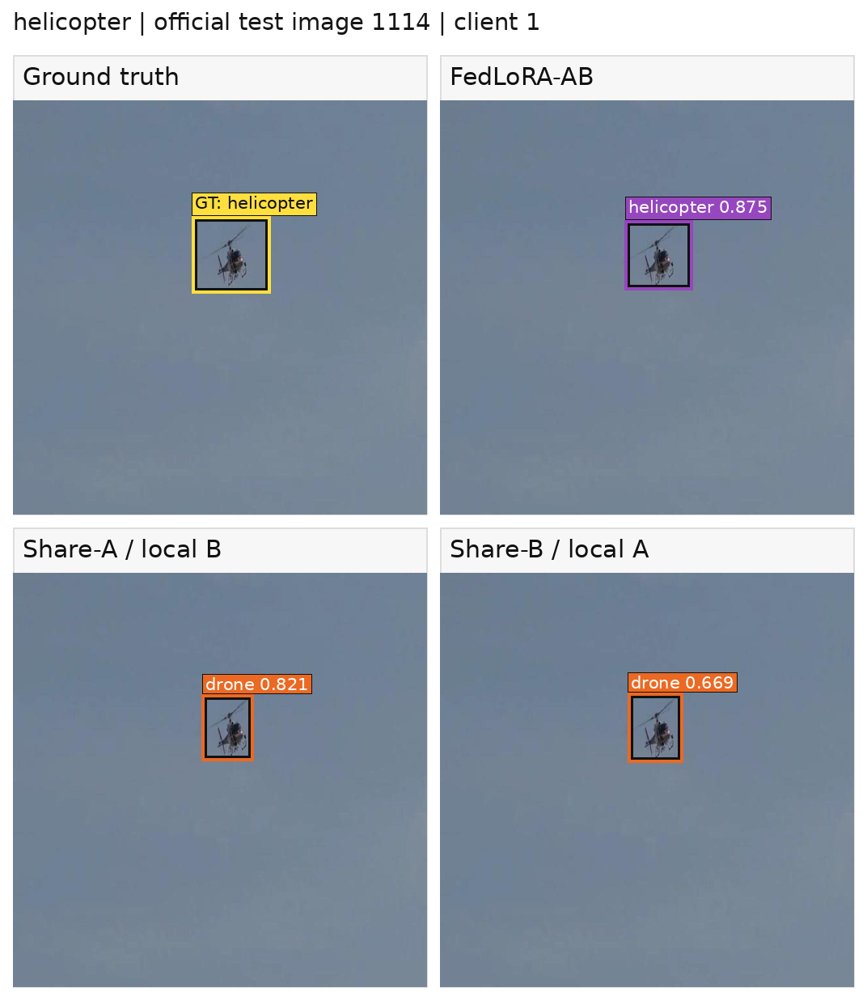

# Where to Adapt and What to Share: Federated LoRA for Aerial Object Detection

Research code and reproducibility materials for an RT-DETR-L study of **where to place LoRA adapters** and **which adapter factors to share** in three-client federated aerial-object detection. The predefined reference configuration is **FedLoRA-AB, Backbone+Decoder, rank 8**.

> **Release-candidate status.** This tree is being prepared for public release. The 96 validation-selected checkpoint binaries and the pretrained RT-DETR-L weight are **not present in this source tree**. The [checkpoint index](artifacts/checkpoint_index.json) contains recorded hashes and sizes, not downloadable models. A public artifact release and the preferred paper citation will be linked only after verification. See the [release checklist](docs/RELEASE_CHECKLIST.md).

## At a glance

- **Task:** four-class detection (airplane, bird, drone, helicopter) on the official AOD-4 v6 COCO train/validation/test export.
- **Model:** RT-DETR-L with adapters in eligible CNN backbone convolutions and decoder self-attention Q/K/V plus cross-attention value projections.
- **Federated policies:** full fine-tuning; shared LoRA A+B+task head (**FedLoRA-AB**); shared A+head with local B (**FedLoRA-A**); shared B+head with local A (**FedLoRA-B**).
- **Primary protocol:** three clients, Dirichlet α=0.4, seeds 42/43/44, 20 rounds × five local epochs, full participation, validation-selected checkpoint.
- **Main observation:** FedLoRA-AB retains 65.39 client-macro AP versus 67.51 for federated full fine-tuning while reducing accounted 20-round model-tensor payload by 98.65%. This is an **analytical tensor-byte comparison**, not measured network traffic.


## Main results

All AP values below are on a **0–100** scale. Entries are mean ± sample standard deviation over three paired `(training seed, partition seed)` runs. “Client-macro AP” averages each aligned model's AP on its own client's test partition; “common-test AP” evaluates each aligned model on the same complete official test split and averages the resulting AP values. The common-test score is not an ensemble.

| Federated method | Client-macro AP ↑ | Common-test AP ↑ | Worst-client AP ↑ | 20-round payload ↓ |
| --- | ---: | ---: | ---: | ---: |
| FedAvg full fine-tuning | 67.51 ± 3.82 | 67.46 ± 0.41 | 60.61 ± 10.15 | 15,783.24 MB |
| **FedLoRA-AB** | **65.39 ± 3.90** | **65.41 ± 0.68** | **58.71 ± 10.50** | **212.78 MB** |
| FedLoRA-A (share A, local B) | 60.58 ± 6.67 | 53.57 ± 5.49 | 53.74 ± 11.46 | 131.68 MB |
| FedLoRA-B (share B, local A) | 60.76 ± 7.29 | 56.29 ± 4.00 | 54.51 ± 10.76 | 85.05 MB |

The 98.65% saving compares the same three-client, 20-round bidirectional shared-state accounting boundary. It excludes the initial common state, the final selected-checkpoint redistribution, serialization and network overhead. Full-FT bytes include FP32 model state and INT64 counters. See [Results and metric definitions](docs/RESULTS.md).

### What the ablations show

At rank 8 under full A+B sharing, moving from **decoder-only → backbone-only → both** yields client-macro AP **55.41 → 65.11 → 65.39**. Backbone-only needs 165.59 MB, 22.18% less than both-targets, with a 0.28-point client-macro AP gap. These target sets have unequal trainable capacity; this is a practical configuration comparison, not a parameter-matched causal test.

Across IID and severe Dirichlet α=0.1 partitions, seed-aligned common-test AP falls by **2.13 ± 1.82** points for FedLoRA-AB, versus **14.48 ± 1.24** for FedLoRA-A and **11.25 ± 1.08** for FedLoRA-B. Full fine-tuning falls by **1.43 ± 0.45** points. Thus AB is the best-retaining **evaluated rank-8 LoRA sharing policy**, not the best method overall. Client assignments differ between partition regimes, so the changes are distribution-shift sensitivity estimates rather than identical-image causal effects.

### Qualitative case: no client-local helicopter training positives

Under the seed-43 Dirichlet α=0.4 partition, client 1 had no helicopter-positive image or box in its local training set, while the other two clients jointly had 5,528 helicopter training boxes. Client 1's validation partition contained 142 helicopter positives and was used for checkpoint selection. This is therefore a **zero local training support** case, not zero-shot or open-vocabulary detection.

On client 1's full 748-image local test partition, which contained 75 helicopter boxes in 75 positive images, client-local helicopter AP was **62.91** for FedLoRA-AB, **0.09** for FedLoRA-A (Share-A / local B), and **8.03** for FedLoRA-B (Share-B / local A), on the README's 0–100 scale. These AP values were computed over the full 748-image partition, so negative/background images and false positives contribute to the metric; they are not AP values restricted to the 75 positive images. A ground-truth-only rule froze three source-disjoint candidates at the p10, p50, and p90 ranks of normalized helicopter-box area before inference. For a compact display, the README shows the p10 and p50 cases. This two-image display subset is illustrative and is not used to compute or rank the quantitative results. All panels use the corresponding rank-8 validation-selected checkpoint and a fixed **0.25 display threshold**.

**Small target (p10; official-test image 62).**



**Median-size target (p50; official-test image 1114).**



FedLoRA-AB labels the target as *helicopter* in both examples, whereas both selective-sharing endpoints label it as *drone*. In the small-target example, FedLoRA-AB and FedLoRA-A also emit off-target *drone* false positives at 0.287 and 0.425; these outputs are intentionally retained rather than hidden. The examples are consistent with the client-local per-class AP result for this single seed/client case, but they do not by themselves establish causal superiority. Federated updates can carry helicopter-relevant information from the other clients, and helicopter-positive validation data informed checkpoint selection. Source images: [AOD-4, Soni et al., Mendeley Data V1](https://doi.org/10.17632/cd5z895tr2.1), licensed [CC BY 4.0](https://data.mendeley.com/datasets/cd5z895tr2/1); model boxes, labels, and the small-target inset were added for this study.

## Reproduce the study

See [Reproducibility](docs/REPRODUCIBILITY.md) for environment setup, AOD-4 preparation, split verification, preflight checks, and commands for the primary, placement, rank, and heterogeneity experiments. The code's named entry points are:

```text
scripts/prepare_split.py            official-v6, source-group-aware client manifests
scripts/preflight.py                dataset/model/gradient validation
scripts/run_solo.sh                 three independent local baselines
scripts/run_centralized.sh          pooled-data reference models
scripts/run_fl.sh                   FedAvg-FT and three LoRA sharing policies
scripts/run_lora_grid.sh            full three-policy placement/rank grid
scripts/run_target_ablation.sh      historical FedLoRA-A target wrapper
scripts/run_rank_sensitivity.sh     historical FedLoRA-A rank wrapper
scripts/run_heterogeneity_cell.sh   IID and Dirichlet α=0.1 cells
scripts/mia_*audit.py               read-only endpoint-MIA sensitivity analyses
scripts/verify_checkpoint_assets.py read-only 96-checkpoint SHA-256 check
scripts/evaluate_checkpoint.py      P0 read-only representative-checkpoint AP replay
scripts/build_representative_release_bundle.py  path-sanitized minimal release builder
scripts/verify_representative_release_bundle.py safe outer/inner release verification
```

The evaluator's exact artifact hashes, safety boundary and artifact-host
acceptance command are documented in [Read-only evaluation](docs/READ_ONLY_EVALUATION.md).
The authors report that the pinned GPU/model path passed that command on
2026-09-23 and matched the archived client-local and common-test metrics within
the frozen absolute tolerance (`1e-6`).

The reported runs used Python 3.9.18, PyTorch 2.5.1+cu124, torchvision 0.20.1, and Ultralytics 8.4.126 on RTX A6000 GPUs. A fresh installation in a different environment should run the tests and preflight before any long training. The study used 640-pixel inputs, batch size eight, AdamW, five-effective-epoch warmup followed by cosine decay, no AMP, and no early stopping. **Do not use test AP to select a checkpoint.**

## Data and artifacts

- Download the public [AOD-4 dataset (Mendeley Data, Version 1)](https://doi.org/10.17632/cd5z895tr2.1) and use the historical AOD-4 v6 COCO export membership: 15,761 train, 4,514 validation, and 2,241 test images. The raw images are **not redistributed here**. See [Dataset and splits](docs/DATASET.md).
- A compact summary and SHA-256 inventory of nine historical schema-v7 split manifests are preserved under [`provenance/splits/`](provenance/splits/) for audit. The complete manifests are a pending separate artifact; they contain original-server paths and must **not** be edited in place. Regenerate local splits for a different data root.
- The [selected-checkpoint index](artifacts/checkpoint_index.json) covers 96 validation-selected models (4,554,894,872 bytes in total). A user-reported read-only server check verified all 96 against their recorded sizes and SHA-256 values; **public downloads are still pending**. See [Checkpoints](docs/CHECKPOINTS.md).
- The first publication gate is a [minimal representative replay bundle](docs/REPRESENTATIVE_RELEASE.md): one path-sanitized personalized checkpoint plus a committed path-free test manifest. AOD-4 images and `rtdetr-l.pt` remain external. The bundle is not called public until a GitHub Release asset has passed clean re-download and GPU replay.
- The 96 complete result JSONs, their derived tables, and the frozen MIA audit are separate research artifacts. The received JSON archive's [SHA-256](artifacts/result_bundle_sha256.txt) is recorded, but its publication location and immutable release identifier will be added only after upload and verification.
- The [server-source comparison](provenance/SERVER_SOURCE_COMPARISON.md) distinguishes byte-identical experiment code from five documented release-only portability/comment edits; recovery/evidence utilities are a separate pending review.
- The [held-out qualitative protocol](docs/QUALITATIVE_TEST.md) documents the seed-43/client-1 zero-local-training-support case, the ground-truth-only p10/p50/p90 selection rule, and the reporting boundaries. The README displays the p10 and p50 static figures; the frozen, path-sanitized selection and prediction record is available as [qualitative metadata](artifacts/qualitative_unseen_helicopter_s43_c1.json). No additional case-specific visualization code is required to interpret the committed figures.

## Interpretation boundaries

The official export has 281 key/hash-connected source components spanning at least two train/validation/test splits, including two exact-SHA cross-split collision signals. Those numbers are **not counts of duplicated images**. Official-split AP is not demonstrated to be source- or semantic-sequence-disjoint; source-filtered detection AP was not computed. The endpoint membership-inference experiments are attack-specific observations, **not differential privacy, server-update protection, or a confidentiality guarantee**. See [Security audit scope](docs/SECURITY_AUDIT.md).

## Repository layout

| Path | Contents |
| --- | --- |
| `main.py`, `federated_main.py` | Experiment entry points |
| `models/`, `trainers/`, `data/`, `configs/`, `utils/` | Detector adapters, training, data validation and metrics |
| `scripts/` | Split generation, run launchers, aggregation, audits |
| `tests/` | Unit/regression tests |
| `provenance/splits/` | Compact historical split summary and full-manifest SHA-256 inventory |
| `artifacts/checkpoint_index.json` | Expected checkpoint SHA-256, size and experiment ID; no binaries |
| `artifacts/*replay_manifest.json` | Path-free, hash-pinned representative test replay metadata |
| `docs/` | Reproduction, data, results, checkpoint and audit documentation |

## Citation and license

**Authors:** Gyeongjin Kim<sup>†</sup>, Yeongjin Jeon<sup>†</sup>, Jae Kwan Park, Yuhyun Chae, and Hyukjin Kwon<sup>*</sup>

<sup>†</sup>Equal contribution. <sup>*</sup>Corresponding author.

The manuscript is under preparation for submission. Use [`CITATION.cff`](CITATION.cff) to cite the software and include the exact commit; a preferred paper citation and persistent identifier will be added when available.

Project-authored code and documentation, and the validation-selected checkpoints released by the authors, are licensed under the **GNU Affero General Public License v3.0 only (`AGPL-3.0-only`)**. Third-party software, the Ultralytics pretrained model, AOD-4 data, and source imagery retain their respective terms. See [`LICENSE`](LICENSE) and [`THIRD_PARTY_NOTICES.md`](THIRD_PARTY_NOTICES.md). The raw AOD-4 images are not redistributed here.
